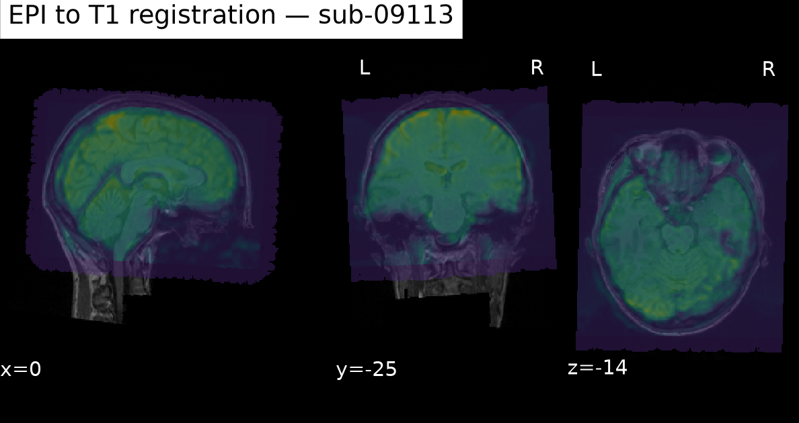
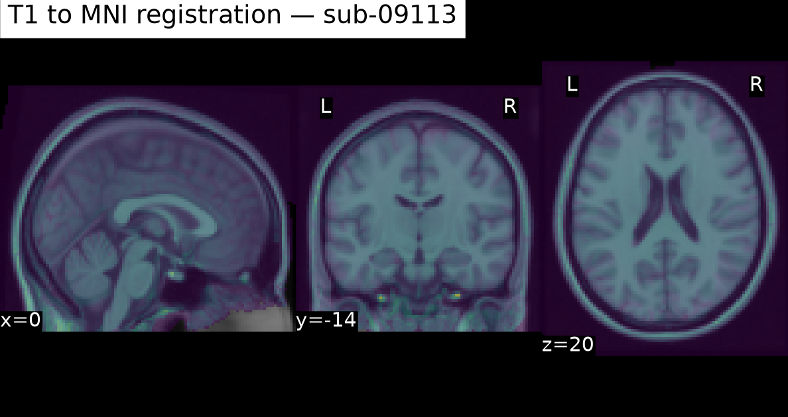
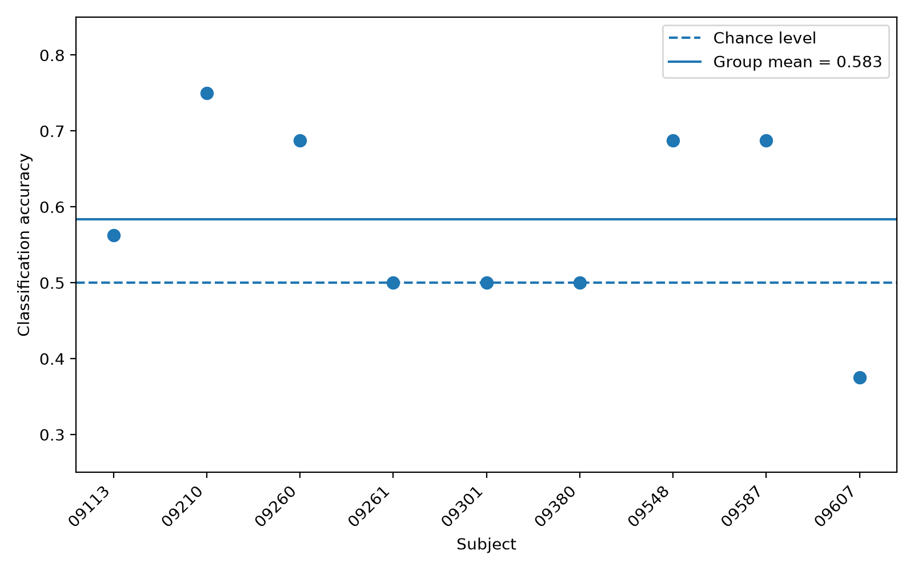
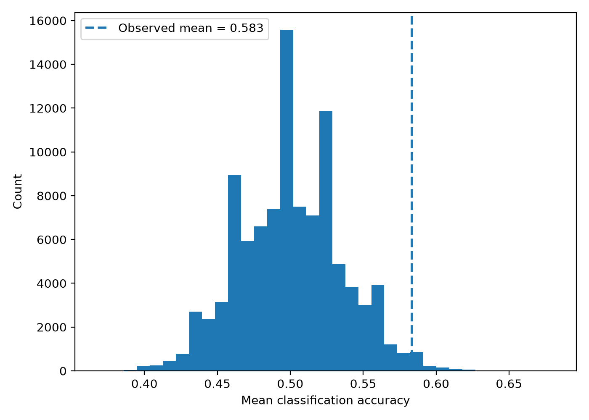

# Heartbeat fMRI reanalysis

This repository contains a reanalysis of the OpenNeuro dataset `ds003763`, based on an fMRI task comparing attention to heartbeats with attention to external sounds.

I started this project to learn the different steps of an fMRI analysis on real data. I first worked through the structure of the BIDS dataset and the preprocessing and registration steps, then implemented a first-level GLM and a small group analysis. I also used the dataset to experiment with ANTs registration and multivariate classification.

## Dataset

The task contains alternating Heart and Sound blocks. Each run has 16 blocks (8 Heart and 8 Sound), with a duration of 20 seconds per block.

The imaging data are not stored in this repository. The analysis was run locally from the original OpenNeuro dataset.

I initially worked with 10 subjects. For the later ANTs/group-analysis branch I retained 9 subjects. `sub-09381` required a different EPI-to-T1 registration procedure during earlier QC, so I did not include it in the new branch rather than mixing registration procedures across subjects.

## Processing and registration

The preprocessing scripts cover:

- inspection of the BIDS files and acquisition parameters
- slice-timing correction
- motion correction and motion QC
- fieldmap preparation
- EPI-to-T1 registration with FSL
- T1-to-MNI registration
- functional and anatomical mask QC

I initially used the FSL registration workflow throughout the pipeline. I later tested nonlinear T1-to-MNI registration with ANTs (rigid, affine and SyN transformations) and checked the resulting transformations before using them for the final group-analysis branch.

The subject-level Heart minus Sound contrast maps were first transformed from native EPI space to T1 space and then from T1 to the MNI152 2 mm template.

### Registration QC

Example registration QC for `sub-09113`. The first image overlays the registered mean EPI on the subject's anatomical T1 image. The second overlays the ANTs-normalized T1 image on the MNI152 2 mm template.





## GLM

The first-level model was fitted separately for each subject in native functional space. The main contrast used here is:

`Heart - Sound`

I then transformed the contrast estimates to MNI space and built a common analysis mask using voxels covered by all 9 subjects.

At the group level, I ran a voxelwise one-sample test on the subject-level contrast estimates. There were 9,866 voxels with uncorrected `p < .05`, but none survived FDR correction at `q < .05`.

As a motion-sensitivity analysis, I refitted the first-level models with one additional nuisance regressor for each volume with framewise displacement above 0.5 mm. Some individual contrast maps changed substantially, especially for subjects with more high-motion volumes. At the group level, this analysis gave 10,580 voxels with uncorrected `p < .05`, but again no voxel survived FDR correction at `q < .05`.

Given the small sample and the absence of corrected effects, I treat this part as an exploratory group analysis.

## MVPA

As a separate analysis, I tested whether Heart and Sound blocks could be distinguished from their multivoxel activity patterns.

For each 20-second block, I averaged the BOLD volumes after shifting the block by 4 seconds to account approximately for the haemodynamic delay. Classification was performed in native functional space.

The classifier was a linear SVM. Within each cross-validation fold, the 1,000 most informative voxels were selected from the training data before standardization and classification. One adjacent Sound/Heart pair was left out at each fold.

Across the 9 subjects, mean classification accuracy was **58.3%**.

For each subject I also evaluated the 256 possible permutations obtained by swapping or not swapping the Heart and Sound labels within each of the eight block pairs. I used these subject-level null distributions to generate a group null distribution. The observed mean accuracy was above this distribution (`p = .014`, Monte Carlo group test).





There is an important limitation here, Heart and Sound alternate systematically within a single run. Condition is therefore partly confounded with temporal position. The pairwise cross-validation and constrained permutations reduce some sources of leakage, but they cannot remove this property of the experimental design. I therefore consider the MVPA exploratory.

## FreeSurfer

I also used FreeSurfer 8.2 to explore cortical surface data and become familiar with its main outputs.

For this part I worked with the precomputed `fsaverage` subject rather than running a complete `recon-all` on the OpenNeuro subjects. I inspected the white and pial surfaces, inflated and spherical representations, cortical thickness and the `aparc` parcellation.

The script in `scripts/freesurfer/` reads these files with NiBabel and computes regional cortical-thickness summaries.

More details are in `docs/freesurfer_workflow.md`.

## Tools

The project was developed under Ubuntu/WSL. The main tools used were Python, FSL, ANTs, NiBabel, Nilearn, scikit-learn and FreeSurfer.

The Python environment used for the project is provided in `environment.yml`.

## Repository

```text
docs/                 notes on specific parts of the analysis
results/              lightweight tables and figures
scripts/              preprocessing, QC and analysis scripts
scripts/freesurfer/   FreeSurfer exploration
environment.yml       Python environment
```

Raw MRI data and large intermediate derivatives are excluded from the repository.